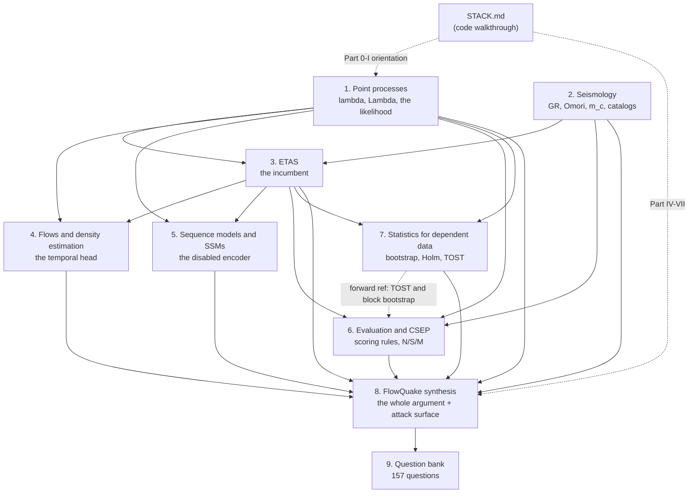

# PRIMER — the FlowQuake first-principles primer

**Entry point for [`docs/`](docs/).** Nine chapters, ~17,000 lines, written for one
purpose: to let someone defend FlowQuake in a viva against a hostile expert who has
read the code, opened the artifacts, and is looking for the joint where the argument
breaks.

The primer is *not* a summary of the paper. It derives, from first principles, every
piece of theory the work stands on — point processes, seismology, ETAS, normalizing
flows, state-space models, scoring rules, dependent-data statistics — and then turns
that theory back on this repository and reports where the repository's own prose does
not survive contact with its own artifacts. Roughly a third of the text is adversarial
against the project it documents. That is deliberate: the fastest way to survive a viva
is to have found the weak points first.

## Who this is for

Someone with strong maths and strong ML who has never seen a point process, has never
opened a seismic catalog, and has to be able to derive `f(tau | H) = lambda ·
exp(-∫lambda)` on a whiteboard, quote `dTot = +0.1133 nats/event` with its artifact
filename, and answer *"isn't initializing your spatial head from the ETAS inversion you
claim to beat circular?"* without flinching.

## How it relates to the other repository documents

| document | what it is | relation to the primer |
|---|---|---|
| **`PRIMER.md`** (this file) | navigation, notation, glossary, memorizable numbers, [the primer's own gaps](#what-this-primer-does-not-cover) | the front door |
| [`docs/00-index.md`](docs/00-index.md) | table of contents down to every H2 section | the map |
| [`STACK.md`](STACK.md) | the **code walkthrough** — which function does what, line by line | the primer derives what STACK.md *states*. Where they disagree, the primer says so and names the file. STACK.md answers "where is it"; the primer answers "why, on what evidence, and where it breaks" |
| [`MANUSCRIPT.md`](MANUSCRIPT.md) | the **paper** — the claim as it would be submitted | the primer is the defence brief for it, including the parts of it that are wrong |
| [`results/CLAIMS.md`](results/CLAIMS.md) | the repo's adversarial claim-to-artifact audit, 142 rows | the primer's factual ground truth. Read it *before* MANUSCRIPT.md |
| [`WORKING.md`](WORKING.md) | honest current-state document and open-item list | the primer's "what is known to be broken" source |
| [`REPRODUCE.md`](REPRODUCE.md) / [`REPLACEMENT_READINESS.md`](REPLACEMENT_READINESS.md) / [`NOVELTY.md`](NOVELTY.md) | reproduction recipe, the five-rung deployment ladder, the prior-art sweep | cited throughout Chapters 6–9 |

**Reading order for a first pass:** this file → `results/CLAIMS.md` → the chapters →
`STACK.md` → `MANUSCRIPT.md`. Reading the manuscript first will make you believe
things the artifacts do not support.

---

## The dependency graph

Chapters 1 and 2 are the only true roots. Everything else has prerequisites; Chapter 8
has all of them, and Chapter 9 tests all of them.

**Plain-list version** (for readers who see no diagram):

- **Chapter 1 — Point processes.** *No prerequisites* beyond undergraduate probability
  and the vocabulary of filtrations. This is the root of everything.
- **Chapter 2 — Seismology.** *Prerequisite:* Chapter 1 (for the vocabulary only; it
  derives no point-process theory). A second root.
- **Chapter 3 — ETAS.** *Prerequisites:* Chapters 1 and 2, plus `STACK.md` Parts 0–I
  for the score conventions.
- **Chapter 4 — Flows and density estimation.** *Prerequisites:* Chapter 3 (kernel
  shapes, the tail argument), Chapter 1 (the `lambda` vs `f(tau|H)` fork). Chapter 2 is
  helpful, not required.
- **Chapter 5 — Sequence models and SSMs.** *Prerequisites:* Chapter 1 (the three
  scores), Chapter 3 (why full-history reach matters), `STACK.md` §7 (the token
  layout). Independent of Chapter 4.
- **Chapter 6 — Evaluation and CSEP.** *Prerequisites:* Chapters 1–3. **Forward-references
  Chapter 7** for TOST and the block bootstrap — read §11 and §16 of Chapter 6 after
  Chapter 7, or accept two forward pointers.
- **Chapter 7 — Statistics for dependent data.** *Prerequisites:* Chapter 1 (the score
  definitions), Chapter 3 (only that ETAS is the comparison model). Can be read
  immediately after Chapter 1 if you want the statistics early.
- **Chapter 8 — FlowQuake synthesis.** *Prerequisites:* **all of 1–7**, plus `STACK.md`.
  Do not read it early; it will read as a list of assertions.
- **Chapter 9 — Question bank.** *Prerequisite:* Chapter 8 immediately before Tier 5.
  Tiers 1–4 are drillable after Chapters 1–7.

Two shortest useful paths:

- **Temporal claim only:** 1 → 4 → 7 → 8 §1, §6.
- **Spatial claim only:** 1 → 2 → 3 → 6 → 8 §3, §10.1–10.2.

---

## Three study plans

### Plan A — two hours ("I have a meeting tomorrow")

Goal: do not say anything false. You will not be able to derive things, but you will
know which numbers are load-bearing and which claims are qualified.

| minutes | read | why |
|---|---|---|
| 0–10 | This file: **The numbers worth memorizing** and **The honest summary**, below | the two things you must not get wrong |
| 10–25 | Ch. 9 [§13 One-page cheat sheet](docs/09-viva-question-bank.md#13-one-page-cheat-sheet) and [§12 The ten questions most likely to sink you](docs/09-viva-question-bank.md#12-the-ten-questions-most-likely-to-sink-you) | the ten highest-damage questions and their strategies |
| 25–45 | Ch. 8 [§1 The claim, in three sentences](docs/08-flowquake-synthesis.md#1-the-claim-in-three-sentences) and [§3 The two-model structure, in full](docs/08-flowquake-synthesis.md#3-the-two-model-structure-in-full) | *the* thing people get wrong: two models, not one |
| 45–65 | Ch. 1 [§3 The hazard view](docs/01-point-processes.md#3-the-hazard-view) and [§4 The likelihood, derived twice](docs/01-point-processes.md#4-the-likelihood-derived-twice) | the single derivation that licenses the whole architecture |
| 65–85 | Ch. 3 [§4 The exact form used by this benchmark](docs/03-etas.md#4-the-exact-form-used-by-this-benchmark) and [§5.1](docs/03-etas.md#5-normalization-in-full) (the `Z_j` derivation) | what you are being compared against, and the one integral you must be able to do |
| 85–105 | Ch. 6 [§3 Information gain: turning nats into a sentence](docs/06-evaluation-and-csep.md#3-information-gain-turning-nats-into-a-sentence) | how to say "+0.1133 nats/event" to a human |
| 105–120 | Ch. 8 [§10 The attack surface, ranked](docs/08-flowquake-synthesis.md#10-the-attack-surface-ranked), items 10.1 and 10.2 only | the two objections that will actually be raised |

**Do not skip** the two-model distinction. Half of all apparent contradictions in this
project come from confusing the production kernel-mixture spatial head (which *loses*
to ETAS by 0.31–0.53 nats on all five California catalogs) with the neural-ETAS
full-history head (which wins by +0.060).

### Plan B — two days

Day 1 (theory you must be able to produce, not recognise):

1. Ch. 1 in full, with pen and paper. Do
   [§11 Worked example A](docs/01-point-processes.md#11-worked-example-a--a-three-event-hawkes-both-likelihood-forms)
   by hand — both likelihood forms, and check the telescoping.
2. Ch. 2 [§4 Completeness magnitude m_c](docs/02-seismology.md#4-completeness-magnitude-m_c),
   [§5 Gutenberg–Richter](docs/02-seismology.md#5-gutenbergrichter-and-the-b-value-done-properly),
   [§6 Omori–Utsu](docs/02-seismology.md#6-omoriutsu-and-why-the-decay-is-a-power-law),
   [§7 Productivity and Båth's law](docs/02-seismology.md#7-productivity-scaling-and-båths-law).
   Skim §1–§3, §8–§12.
3. Ch. 3 §§3–7 in full ([building ETAS](docs/03-etas.md#3-building-etas-from-three-laws),
   [the exact form](docs/03-etas.md#4-the-exact-form-used-by-this-benchmark),
   [normalization](docs/03-etas.md#5-normalization-in-full),
   [the branching ratio](docs/03-etas.md#6-the-branching-ratio-for-this-parameterization),
   [EM fitting](docs/03-etas.md#7-fitting-the-em--stochastic-declustering-inversion)),
   then [§13 Worked example](docs/03-etas.md#13-worked-example) with a calculator.
   The number to internalise is `a_eff = a − rho·gamma`.
4. Ch. 4 [§3 Continuous normalizing flows](docs/04-flows-and-density-estimation.md#3-continuous-normalizing-flows),
   [§6 Flow matching](docs/04-flows-and-density-estimation.md#6-flow-matching-the-theorem-that-makes-this-cheap),
   [§7 The specific path FlowQuake uses](docs/04-flows-and-density-estimation.md#7-the-specific-path-flowquake-uses),
   [§13 Worked example 2 — the unit conversion](docs/04-flows-and-density-estimation.md#13-worked-example-2--the-unit-conversion-term-by-term).

Day 2 (evidence, statistics, and the attack surface):

5. Ch. 6 [§2 Scoring rules](docs/06-evaluation-and-csep.md#2-scoring-rules-from-first-principles),
   [§3 Information gain](docs/06-evaluation-and-csep.md#3-information-gain-turning-nats-into-a-sentence),
   [§8 The consistency tests, defined](docs/06-evaluation-and-csep.md#8-the-consistency-tests-defined) —
   **including §8.5, the nonstandard two-sided pass rule**.
6. Ch. 7 [§2 Why `n` is a lie](docs/07-statistics-dependent-data.md#2-why-n-is-a-lie),
   [§7 Bootstrap p-values and the resolution floor](docs/07-statistics-dependent-data.md#7-bootstrap-p-values-and-the-resolution-floor),
   [§10 TOST](docs/07-statistics-dependent-data.md#10-equivalence-testing-tost),
   [Worked example 1 — Holm by hand](docs/07-statistics-dependent-data.md#worked-example-1--holm-by-hand-on-the-six-regional-dt-p-values).
7. Ch. 5 [§15 The honest part: this encoder is off in every production run](docs/05-sequence-models-ssm.md#15-the-honest-part-this-encoder-is-off-in-every-production-run)
   only. Skip the SSD machinery unless an examiner is a Mamba person.
8. Ch. 8 in full. This is the day's centrepiece.
9. Ch. 9 Tier 5 ([Hostile / defence, Q104–Q129](docs/09-viva-question-bank.md#6-tier-5--hostile--defence-q104q129))
   out loud, with someone playing the sceptic.

### Plan C — one week (be genuinely fluent)

| day | material | the test you must pass |
|---|---|---|
| **1** | Ch. 1 in full; both worked examples reproduced in Python | Derive the likelihood twice and prove the forms equal, from memory. State the time-rescaling theorem and prove it. Explain why the repo reports *no* rescaling residuals ([§5.5](docs/01-point-processes.md#55-the-repo-does-not-do-this)) |
| **2** | Ch. 2 in full; both b-value worked examples by hand | Derive the Aki MLE and its standard error; explain the Utsu/Bender half-bin correction; state the `+0.005` problem in `heads.py` ([§5.5](docs/02-seismology.md#55-the-0005-in-headspy--what-it-corrects-and-the-doc-bug)) and why it is wrong for *some* catalog whichever way ComCat's precision resolves |
| **3** | Ch. 3 in full, including [§12 the strict-superset proof](docs/03-etas.md#12-how-flowquakes-neural-etas-head-generalizes-etas) and [§13 the worked example](docs/03-etas.md#13-worked-example) | Derive `Z_j`, derive the branching ratio, and produce the `n = 0.95` vs `n = 1.73` contrast from the `a` vs `a_eff` error |
| **4** | Ch. 4 in full; run the RK4 convergence table | State and sketch the CFM gradient-equivalence theorem; derive `log f(tau) = log p(u) − log sigma − log tau`; answer H1 (step count) and H2 (the `tau` floor) |
| **5** | Ch. 5 §§1–4, §§6, §§8–10, §§13–15; do the `L = 4`, `Q = 2` worked example by hand | Derive state-space duality on a whiteboard; state the production temporal head's receptive field (**64 events**) and why that matters |
| **6** | Ch. 6 in full and Ch. 7 in full; reproduce the Holm table and the McNemar p-value | Prove the log score is strictly proper; prove Holm controls FWER under arbitrary dependence; derive TOST and explain the 90% interval |
| **7** | Ch. 8 in full, then Ch. 9 end to end (all 157 questions, out loud, timed) | Every hostile question in Tier 5 answered with a concession followed by a pivot, and every headline number quoted **with its artifact filename** |

Throughout Plan C, keep [`results/CLAIMS.md`](results/CLAIMS.md) open. Nothing in the
primer is more valuable in a viva than being the first person in the room to say a
number is unbacked.

---

## Chapter by chapter

| # | chapter | what it buys you | hardest section | key derivation |
|---|---|---|---|---|
| 1 | [Point processes from first principles](docs/01-point-processes.md) | The right to model `f(tau\|H)` instead of `lambda(t\|H_t)` and still call the result a likelihood | [§4.1 the bin-partition derivation](docs/01-point-processes.md#4-the-likelihood-derived-twice) — where the `n log Delta` volume element goes | `log L = Σ log lambda(t_i) − ∫lambda` **=** `Σ log f(tau_i\|H) + log S(T−t_n)`, by telescoping the compensator increments |
| 2 | [Seismology for the point-process modeller](docs/02-seismology.md) | The ability to argue with a seismologist about what a catalog *is*, and to see which numbers measure physics and which measure the network | [§6.3 Dieterich's rate-and-state derivation of Omori](docs/02-seismology.md#6-omoriutsu-and-why-the-decay-is-a-power-law) | `R(t) = r/{[e^{−Δτ/(Aσ)}−1]e^{−t/t_a}+1}` → `K/(t+c)` with `p = 1` exactly, for `t << t_a` |
| 3 | [ETAS, derived and dissected](docs/03-etas.md) | The incumbent, transcribed from *this repo's code*, with every parameter's units and every pathology named | [§6.2 the effective productivity exponent](docs/03-etas.md#6-the-branching-ratio-for-this-parameterization) | `Z_j = ∫(r²+d_j)^{−(1+rho)} dA = pi/(rho·d_j^rho)`, hence `a_eff = a − rho·gamma`, hence `n = N(m_c)·beta/(beta − a_eff)` |
| 4 | [Neural density estimation, flows, flow matching](docs/04-flows-and-density-estimation.md) | Why the temporal head is exact, what `sigma_min` really does, and the two open empirical checks | [§6.3 the gradient-equivalence theorem](docs/04-flows-and-density-estimation.md#6-flow-matching-the-theorem-that-makes-this-cheap) | `d/dt_flow log p_t = −div v` (Jacobi's formula route), then `∇_θ L_FM = ∇_θ L_CFM` because `w_t(z) = E[w_t(z\|u) \| z_t = z]` |
| 5 | [Sequence models and selective SSMs](docs/05-sequence-models-ssm.md) | The Mamba-2 machinery *and* the proof that it is switched off in every production run | [§10 the chunked scan, line by line against `ssm.py`](docs/05-sequence-models-ssm.md#10-the-chunked-parallel-scan-derived-against-ssmpy) | State-space duality: unroll `H_t = a_t H_{t−1} + Δ_t B_t x_tᵀ`, contract with `C_t`, get masked linear attention with mask `L(t,s) = Π_{r=s+1..t} a_r` |
| 6 | [Forecast evaluation: scoring rules, IG, CSEP](docs/06-evaluation-and-csep.md) | Propriety, the N/S/M tests, and the fact that the repo's pass rule is **not** the classical one | [§8.5 the pass criterion, verified against the code](docs/06-evaluation-and-csep.md#8-the-consistency-tests-defined) | Log score strictly proper: `S(G,G) − S(F,G) = KL(g‖f) ≥ 0` by Jensen, equality iff `f = g` a.e. — and it needs `∫f = 1` |
| 7 | [Statistics for dependent data](docs/07-statistics-dependent-data.md) | Why 21,889 events are ~2,469 independent observations, and what a bootstrap CI actually estimates | [§4.5 what the stationary bootstrap estimates](docs/07-statistics-dependent-data.md#4-the-block-bootstrap-family) | `Cov*(X*_j, X*_{j+k}) = (1−p)^k ĝ_c(k)` from the Markov-chain view, so the SB variance is a **geometric lag window** on the long-run variance; for AR(1), `VIF_SB(L) = (1+q)/(1−q)`, `q = phi(1−1/L)` |
| 8 | [FlowQuake: the whole argument, and every joint](docs/08-flowquake-synthesis.md) | The claim, its qualifiers, its claim inventory, and its ranked attack surface | [§4.3 why 0.3-sigma noise did not stop memorization](docs/08-flowquake-synthesis.md#4-the-memorization-result-in-depth) | Gaussian channel capacity `C_h = (h/2)ln(1+P/σ²)`; solving for the 3.1377-nat train gain gives `P = 0.342`, RMS **0.585** per dim — so width bounds nothing when power is free |
| 9 | [The question bank](docs/09-viva-question-bank.md) | 157 questions in seven tiers, with model answers and concede-then-pivot scripts | [Tier 5 — Hostile / defence](docs/09-viva-question-bank.md#6-tier-5--hostile--defence-q104q129) | Not a derivation: the **skill** of conceding in one sentence and pivoting to the narrower claim the evidence supports |

---

## The master notation table

Every symbol used anywhere in the primer. **Read the collision section first.**

### Collisions — the ones that will actually trip you

The primer fixes a convention for each; the *repository's code* does not always agree,
and the table says so.

| collision | the two (or more) meanings | primer's convention |
|---|---|---|
| **`tau`** ⚠️ | (a) **inter-event gap**, days — Ch. 1, 4, 8, 9. (b) The ETAS **Omori exponential taper timescale**, days — and this is what the repo's `parameters_0.json` and `neural_etas.py` literally call `tau`. (c) The **alarm fraction** in a Molchan diagram, Ch. 6 §12. (d) Shear stress `tau` and stressing rate `tau_dot_r`, Ch. 2 §6.3 | **A bare `tau` is always an inter-event gap.** The ETAS taper is always written **`tau_tap`**. Where a code snippet is transcribed verbatim you will see the repo's `tau`; that is always `tau_tap`. The Molchan `tau` appears only inside Ch. 6 §12 and is labelled there |
| **`t`** ⚠️ | (a) **event time**, days since catalog start. (b) **`t_flow`**, the flow's ODE integration variable in `[0,1]` — Ch. 4. (c) The **sequence index** (event index, not seconds) in Ch. 5 | **`t` is event time in days; the flow's clock is always `t_flow` and never abbreviated.** There is no relationship between the two. In Ch. 5, `t` is an integer event index and `t_days` is written out where confusion is possible |
| **`n`** | (a) the **number of events** (integer, thousands). (b) the **branching ratio** (dimensionless, in `[0,1)`) | Context disambiguates by magnitude. Ch. 3 reserves `n` for the branching ratio and writes **`N_ev`** for the event count |
| **`rho`** | (a) ETAS **spatial power-law exponent**, `(r²+d_j)^{−(1+rho)}` — dimensionless. (b) `heads.py`'s **elliptical aspect ratio**, `rho ≥ 1`, axes `d·rho` and `d/rho`. (c) **Autocorrelation** `rho_k` (Ch. 7). (d) **Spectral radius** `rho(W)` (Ch. 5 §2.3) | Always labelled at the point of use. (a) and (b) both appear in Ch. 2 §9 and Ch. 8 §2.7 |
| **`a`** | (a) ETAS **productivity exponent**, 1/mag. (b) **`a_GR`**, the Gutenberg–Richter intercept. (c) SSM **decay** `a_t = exp(−Δ_t A_h)`. (d) BCa **acceleration**. (e) the **backward recurrence time** in Ch. 1 §6.5 | Ch. 3 writes the GR intercept `a_GR` explicitly to free `a` for productivity |
| **`beta`** | (a) **`beta = b·ln 10`**, the GR magnitude rate, 1/mag. (b) the exponential Hawkes kernel decay rate, 1/day (Ch. 1 §11). (c) `beta_s`, crustal shear-wave speed | (a) unless inside Ch. 1's exponential-kernel example |
| **`A`** | (a) **region area**, km². (b) **rupture area**, m² (Ch. 2 §1.2). (c) the SSM **state matrix**, and `A_h` the per-head scalar decay | Ch. 3 fixes `A` = region area |
| **`d`** | (a) ETAS **spatial scale at `m = m_c`, in km²** (it is added to `r²`). (b) `heads.py` kernel scale **`d` in km** (`(1+r²/d²)^{−q}`). (c) the **flow's state dimension** (1 here). (d) SSM **model width**. (e) `D`, **average slip**, m. (f) `d_i`, the per-event **log-score difference**, nats | Ch. 8 §2.6 calls this out as a "reading trap". Units disambiguate (a) from (b) |
| **`L`** | (a) **likelihood**. (b) **sequence length**. (c) bootstrap **block length**. (d) **rupture length**, km. (e) the SSD **decay mask** `L(t,s)` | Ch. 7 states "`L` always means a bootstrap block length, never a likelihood" |
| **`H`** | (a) the **history / filtration** `H_t`. (b) the **number of SSM heads**. (c) `H(T)`, ETAS's **Omori time integral**. (d) `Hc`, the **cumulative hazard** | `H_t` always carries its subscript |
| **`N`** | (a) the **counting process** `N(t)`. (b) the SSM **state dimension**. (c) the **number of test events** | `N(t)` always carries its argument |
| **`p`** | (a) the **Omori exponent**, `p = 1 + omega`. (b) a **p-value**. (c) the geometric **restart probability** `p = 1/L` in the stationary bootstrap. (d) a generic **density** `p(·)` | Context; the Omori `p` appears only in Ch. 2–3 |
| **`q`** | (a) the **data distribution** in flow matching. (b) the `heads.py` **kernel exponent** (`q ≥ q_floor = 1.15`). (c) a **bootstrap quantile** `q*_alpha`. (d) `q = phi(1−1/L)` in the AR(1) block-bootstrap formula | Labelled at use |
| **`m`** | (a) **magnitude**. (b) the **number of hypotheses** in a Holm family (Ch. 7 §8) | Ch. 7 §8 is the only place (b) appears |
| **`mu`** | (a) ETAS/Hawkes **background rate** (events/day, or events/km²/day in ETAS). (b) `mu_shear`, the **shear modulus**, Pa. (c) `mu_f`, the **friction coefficient**. (d) `mu_n` = `log_tau_mean`, the flow's normalization mean | Subscripts everywhere except (a) |
| **`K`** | (a) Omori **productivity** `K/(t+c)^p`. (b) the SSM **convolution kernel** `K_r`. (c) the **number of mixture components**. (d) `K_j`, ETAS's **unnormalized spatial kernel** | Labelled at use |
| **`S`** | (a) the **survivor function** `S(tau)`. (b) a **scoring rule** `S(F,y)`. (c) the SSD **chunk summary state**. (d) the CSEP **S-test** | `S(tau)` always carries its argument |
| **`sigma`** | (a) `sigma_min`, the flow-matching **bandwidth floor** (normalized units). (b) `sigma_n` = `log_tau_std`, the flow's normalization scale (also written `sigma_LT`). (c) `sigma_b`, the **b-value standard error**. (d) effective **normal stress** (Ch. 2 §6.3). (e) `sigma_1(W)`, the largest **singular value**. (f) `sigma_i`, the **adaptive KDE bandwidth**, km | Subscripted everywhere except (a) |
| **`Delta`** | (a) the **bin width** in the likelihood bin-partition derivation, days. (b) `Delta_t`, the SSM **step size** (dimensionless selectivity knob, *not* a physical duration). (c) the **magnitude grid width**. (d) `Delta_tau`, a **stress step**, MPa; `Delta_CFS`, a Coulomb stress change | Ch. 5 states explicitly that `Delta_t` "is the SSM step size, never a physical duration" |

### Core symbols

| symbol | meaning | units | defined in |
|---|---|---|---|
| `N(t)` | counting process: number of points in `[0, t]` | integer | [Ch. 1 §1.2](docs/01-point-processes.md#1-the-object-counting-processes-histories-and-simplicity) |
| `H_t` | history / internal filtration `sigma(N(u) : u < t)` — **strictly before `t`** | — | [Ch. 1 §1.3](docs/01-point-processes.md#1-the-object-counting-processes-histories-and-simplicity) |
| `lambda(t \| H_t)` | conditional intensity: instantaneous rate given the past | events/day | [Ch. 1 §2.1](docs/01-point-processes.md#2-the-conditional-intensity) |
| `Lambda(t)` | compensator, `∫_0^t lambda(u\|H_u) du` — random, path-dependent, non-decreasing | expected count (dimensionless) | [Ch. 1 §2.3](docs/01-point-processes.md#2-the-conditional-intensity) |
| `M(t)` | the martingale `N(t) − Lambda(t)` (Doob–Meyer) | — | [Ch. 1 §2.3](docs/01-point-processes.md#2-the-conditional-intensity) |
| `t_i` | time of the `i`-th event | days since catalog start | Ch. 1 §1.1 |
| `tau`, `tau_i` | inter-event gap, `t_i − t_{i−1}` | days | Ch. 1 §1.1 |
| `T` | end of the observation window | days | Ch. 1 §4 |
| `S(tau)`, `F(tau)`, `f(tau\|H)`, `h(tau)` | survivor, cdf, density, hazard of the next gap | `f`, `h`: 1/day | [Ch. 1 §3.1](docs/01-point-processes.md#3-the-hazard-view) |
| `xi_i` | rescaled gap = compensator increment `Lambda(t_i) − Lambda(t_{i−1})` | dimensionless; `Exp(1)` under `H_0` | [Ch. 1 §5.1](docs/01-point-processes.md#5-time-rescaling) |
| `u_i` | PIT value `F(tau_i \| H)`; also `1 − e^{−xi_i}` | `Uniform(0,1)` under `H_0` | Ch. 1 §5.2, Ch. 6 §5.1 |
| `s = (x, y)` | event location, azimuthal-equidistant projection | km | Ch. 1 §9.1 |
| `m` | magnitude | magnitude units | Ch. 2 |
| `m_c` | completeness magnitude (`mcut` in configs) | magnitude units | [Ch. 2 §4](docs/02-seismology.md#4-completeness-magnitude-m_c) |
| `k_i` | the mark of event `i`, here `(s, m)` | — | Ch. 1 §9.1 |
| `A` | region area | km² | Ch. 3 §4.1 |
| `n` | **branching ratio** = expected direct offspring per event | dimensionless, `< 1` required | [Ch. 1 §8.3](docs/01-point-processes.md#8-hawkes-processes), [Ch. 3 §6](docs/03-etas.md#6-the-branching-ratio-for-this-parameterization) |
| `N_ev` | number of events in a catalog (Ch. 3's notation) | integer | Ch. 3 §7.2 |

### Seismology

| symbol | meaning | units | defined in |
|---|---|---|---|
| `M0` | seismic moment, `mu_shear · A_rupture · D` | N·m (SI) or dyne·cm (cgs); 1 N·m = 1e7 dyne·cm | [Ch. 2 §1.2](docs/02-seismology.md#1-what-an-earthquake-physically-is) |
| `Mw` | moment magnitude, `(2/3)(log10 M0 − 9.1)` (IASPEI) | magnitude units | Ch. 2 §1.3 |
| `ML, mb, Ms, Md` | local, body-wave, surface-wave, coda-duration magnitudes | magnitude units | [Ch. 2 §2](docs/02-seismology.md#2-magnitude-scales-saturation-and-why-mixing-them-is-dangerous) |
| `mu_shear` | shear modulus (rigidity) | Pa (30 GPa crust) | Ch. 2 §1.2 |
| `D` | average slip over the rupture | m | Ch. 2 §1.2 |
| `b` | Gutenberg–Richter b-value | dimensionless (≈1) | [Ch. 2 §5.1](docs/02-seismology.md#5-gutenbergrichter-and-the-b-value-done-properly) |
| `beta` | `b · ln 10` — the GR exponential rate | 1/magnitude unit (≈2.3026) | Ch. 2 §5.1 |
| `a_GR` | Gutenberg–Richter intercept, `log10 N(≥m) = a_GR − b·m` | — | Ch. 3 §2 |
| `dm`, `mbin` | magnitude reporting grid width | magnitude units (0.1 or 0.01) | Ch. 2 §5.4 |
| `p` | Omori–Utsu decay exponent; `p = 1 + omega` in this repo | dimensionless (0.9–1.2) | [Ch. 2 §6.1](docs/02-seismology.md#6-omoriutsu-and-why-the-decay-is-a-power-law) |
| `c` | Omori short-time regularizer | days (1e−3 – 1e−1) | Ch. 2 §6.2 |
| `alpha` | Utsu productivity exponent, base 10; `a = alpha · ln 10` | 1/magnitude unit (0.8–1.0) | [Ch. 2 §7](docs/02-seismology.md#7-productivity-scaling-and-båths-law) |
| `f_c` | corner frequency, `∝ M0^{−1/3}` under constant stress drop | Hz | Ch. 2 §2.1 |
| `t_a` | rate-and-state aftershock duration, `A·sigma / tau_dot_r` | days–years | Ch. 2 §6.3 |
| `Delta_CFS` | Coulomb failure stress change | MPa (0.01–0.1 triggers) | [Ch. 2 §9](docs/02-seismology.md#9-triggering-static-dynamic-and-why-space-is-anisotropic) |
| `sigma_i` | adaptive-KDE bandwidth = distance to `k`-th nearest neighbour (`k = 6`), clipped `[1, 60]` | km | [Ch. 2 §10](docs/02-seismology.md#10-spatial-structure-and-background-models) |

### ETAS

| symbol | code name | meaning | units | defined in |
|---|---|---|---|---|
| `mu` | `mu` (`10^log10_mu`) | background rate density (uniform over the region) | events km⁻² day⁻¹ | [Ch. 3 §4.2](docs/03-etas.md#4-the-exact-form-used-by-this-benchmark) |
| `k0` | `k0` (`10^log10_k0`) | productivity level at `m = m_c` | mixed (day^omega) | Ch. 3 §4.2 |
| `a` | `a` | productivity exponent in magnitude | 1/magnitude unit | Ch. 3 §4.2 |
| `c` | `c` (`10^log10_c`) | Omori regularizer | days | Ch. 3 §4.2 |
| `omega` | `omega` | Omori exponent offset; **`p = 1 + omega`** | dimensionless | [Ch. 3 §4.3](docs/03-etas.md#4-the-exact-form-used-by-this-benchmark) |
| **`tau_tap`** ⚠️ | **`tau`** in the repo | exponential taper timescale on the Omori tail | days (10³–10⁴) | [Ch. 3 §4.4](docs/03-etas.md#4-the-exact-form-used-by-this-benchmark) |
| `d` | `d` (`10^log10_d`) | aftershock-zone **area** scale at `m = m_c` (added to `r²`) | **km²** | Ch. 3 §4.2 |
| `gamma` | `gamma` | magnitude scaling of the aftershock zone | 1/magnitude unit | Ch. 3 §4.2 |
| `rho` | `rho` | spatial tail exponent; kernel decays as `r^{−2(1+rho)}` | dimensionless | Ch. 3 §4.2 |
| `w_j(Δt)` | `w` | triggering weight of past event `j` | — | Ch. 3 §4.1 |
| `d_j` | `dmj` | `d · exp(gamma(m_j − m_c))` | km² | Ch. 3 §4.1 |
| `K_j(r²)` | `kj` | unnormalized spatial kernel `(r² + d_j)^{−(1+rho)}` | — | Ch. 3 §4.1 |
| `Z_j` | `zj` | `∫_{R²} K_j dA = pi / (rho · d_j^rho)` | km² | [Ch. 3 §5.1](docs/03-etas.md#5-normalization-in-full) |
| `H(T)` | `H` / `cum` | `∫_0^T e^{−u/tau_tap}(u+c)^{−(1+omega)} du`, by quadrature | days^{−omega} | Ch. 3 §4.4, §5.4 |
| `lambda*(t)` | `lam_star` | total rate over the region = the temporal intensity | events/day | Ch. 3 §5.3 |
| `a_eff` | — | `a − rho·gamma`, the **effective** productivity exponent | 1/magnitude unit | [Ch. 3 §6.2](docs/03-etas.md#6-the-branching-ratio-for-this-parameterization) |
| `p_ij`, `p_i0` | — | EM responsibilities: `P(i` triggered by `j)`, `P(i` is background`)` | probabilities | [Ch. 3 §7.3](docs/03-etas.md#7-fitting-the-em--stochastic-declustering-inversion) |

### Flows and the temporal head

| symbol | meaning | units | defined in |
|---|---|---|---|
| **`t_flow`** ⚠️ | the flow's ODE integration variable, `[0, 1]` — **never event time** | dimensionless | [Ch. 4 notation](docs/04-flows-and-density-estimation.md#what-this-chapter-buys-you) |
| `z`, `z0` | flow state; `z0 = z(t_flow = 0)` is the latent, `z(1)` the data side | normalized units | Ch. 4 §3.1 |
| `u` | the datum the flow models: `(log tau − mu_n) / sigma_n` | dimensionless | [Ch. 4 §13](docs/04-flows-and-density-estimation.md#13-worked-example-2--the-unit-conversion-term-by-term) |
| `mu_n`, `sigma_n` | `log_tau_mean`, `log_tau_std` — train-era normalization constants (also `sigma_LT`) | log-days | Ch. 4 §13.1 |
| `v(z, t_flow, c)` | learned velocity field (SiLU MLP, `C^∞`, globally Lipschitz) | — | Ch. 4 §3.2 |
| `p_0`, `p_t`, `p_1`, `q` | base `N(0,I)`, probability path, model density, data distribution | — | Ch. 4 §6.1 |
| `sigma_min` | flow-matching bandwidth floor; `p_1 = q ∗ N(0, sigma_min²)` | normalized units (0.02) | [Ch. 4 §7.2](docs/04-flows-and-density-estimation.md#7-the-specific-path-flowquake-uses) |
| `J_f`, `det J` | Jacobian of the flow map and its determinant | — | Ch. 4 §2.1 |
| `eps` | Hutchinson probe vector (**not used in this repo**) | — | Ch. 4 §4.2 |
| `L_FM`, `L_CFM` | marginal and conditional flow-matching losses | — | Ch. 4 §6.3 |
| `d`, `q` (heads) | `heads.py` kernel scale (km) and exponent (`q ≥ 1.15`) in `(q−1)/(pi d²)(1+r²/d²)^{−q}` | km, dimensionless | Ch. 8 §2.6 |
| `rho`, `theta` (heads) | area-preserving ellipse aspect ratio and orientation, axes `d·rho` and `d/rho` | dimensionless, radians | Ch. 8 §2.7 |

### Sequence models

| symbol | meaning | units | defined in |
|---|---|---|---|
| `L`, `d`, `N`, `P`, `Q`, `H` | sequence length, model width, SSM state dim, per-head channel width, chunk length, number of heads | integers | [Ch. 5 notation](docs/05-sequence-models-ssm.md#what-this-chapter-buys-you) |
| **`Delta_t`** ⚠️ | SSM step size / selectivity knob, `softplus(linear(u_t) + bias)` — **not a physical duration** | dimensionless | Ch. 5 §6.3, §8.1 |
| `A, B, C, D` | SSM state, input, output and skip matrices; `A_h` the per-head scalar decay | — | Ch. 5 §5.1, §9.1 |
| `A_bar, B_bar` | discretized transition and input maps; ZOH `A_bar = exp(Delta A)` | — | [Ch. 5 §6.1](docs/05-sequence-models-ssm.md#6-discretization-zero-order-hold-and-bilinear) |
| `a_t` | per-step decay `exp(−Delta_t A_h)` — literally a forget gate | `(0,1)` | Ch. 5 §8.3 |
| `L(t,s)` | SSD decay mask `Π_{r=s+1..t} a_r` | `(0,1]` | [Ch. 5 §9.3](docs/05-sequence-models-ssm.md#9-mamba-2--ssd-and-the-duality-proof) |
| `cs` | within-chunk cumulative sum of `log a_r` (always in log space) | ≤ 0 | Ch. 5 §10.2 |
| `h_bottleneck` | width of the learned global channel; **0 in every production run** | integer | Ch. 5 §15.1 |
| `rho(W)`, `sigma_1(W)` | spectral radius and largest singular value | — | Ch. 5 §2.3 |

### Scores, evaluation and statistics

| symbol | meaning | units | defined in |
|---|---|---|---|
| `tll` | `log f_t(tau)` — mean per-event temporal log-density | log(1/day) | Ch. 1 §4.4, Ch. 6 §1 |
| `sll` | `log f_s(x, y)` — mean per-event spatial log-density | log(1/km²) | Ch. 3 §5.3 |
| `mll` | `log f_m(m)` — mean per-event magnitude log-density | log(1/magnitude unit) | Ch. 2 §5.5 |
| `nll` | `−(tll + sll)` — **excludes `mll`** by EarthquakeNPP convention | nats/event | Ch. 1 §4.4 |
| `dT`, `dS`, `dTot` | paired per-event gains, FlowQuake minus ETAS | nats/event | Ch. 7 §1 |
| `IG` | information gain per event = mean paired log-score difference | nats/event (÷ ln 2 for bits) | [Ch. 6 §3](docs/06-evaluation-and-csep.md#3-information-gain-turning-nats-into-a-sentence) |
| `S(F, y)` | a scoring rule (positively oriented here: higher is better) | — | [Ch. 6 §2.1](docs/06-evaluation-and-csep.md#2-scoring-rules-from-first-principles) |
| `delta_1`, `delta_2` | CSEP quantiles `P(T_sim ≥ T_obs)`, `P(T_sim ≤ T_obs)`; sum to `1 + P(tie)` | probabilities | [Ch. 6 §8](docs/06-evaluation-and-csep.md#8-the-consistency-tests-defined) |
| `gamma_s`, `gamma_m` | pyCSEP S- and M-test quantile scores (`= delta_2`) | probabilities | Ch. 6 §8.2–8.3 |
| `J`, `n_sims` | number of simulated catalogs per forecast day (`n_cat` in pyCSEP) | integer (10³ or 10⁴) | Ch. 6 §10 |
| `rho_k`, `gamma_k` | autocorrelation and autocovariance at lag `k` | — | [Ch. 7 §2.1](docs/07-statistics-dependent-data.md#2-why-n-is-a-lie) |
| `VIF`, `n_eff` | variance inflation factor and effective sample size, `n_eff = n / VIF` | dimensionless, integer | Ch. 7 §2.1 |
| `sigma_LR²` | long-run variance `Σ_k gamma_k` — what every block bootstrap estimates | — | Ch. 7 §2.1, §4.5 |
| `L` (bootstrap) | **mean block length**; `mean_block = 50` events, hard-coded | events | [Ch. 7 §5](docs/07-statistics-dependent-data.md#5-choosing-the-block-length) |
| `B`, `n_boot` | bootstrap replicates: 2,000 for CIs, 4,000 for p-values and TOST | integer | Ch. 7 §7.1 |
| `phi` | AR(1) coefficient; `VIF = (1+phi)/(1−phi)` | dimensionless | Ch. 7 §2.2 |
| `m` (Holm) | number of hypotheses in the family (6 here) | integer | [Ch. 7 §8.3](docs/07-statistics-dependent-data.md#8-multiple-comparisons-fwer-fdr-and-a-proof-of-holm) |
| `delta` (TOST) | pre-stated equivalence margin (0.05 and 0.10 nats/event here) | nats/event | [Ch. 7 §10.2](docs/07-statistics-dependent-data.md#10-equivalence-testing-tost) |
| `n10`, `n01`, `d` | McNemar discordant counts and their total | integer | [Ch. 7 §11.1](docs/07-statistics-dependent-data.md#11-mcnemars-test) |
| `theta` | the estimand `E[g]`; also the McNemar discordance ratio `p10/(p10+p01)` | nats/event; probability | Ch. 6 §4.2, Ch. 7 §11.3 |

### Repository constants worth knowing by name

`TAU_FLOOR_DAYS = 1e-7` d (~8.6 ms) · `RECENCY_LAGS = (1,2,4,8,16,32,64)` ·
`TOKEN_DIM = 32` · `SAFE_TOKEN_DIMS` = 30 dims (`[0,3] + range(4,32)`, i.e. **no
absolute `x, y`**) · `cond_dim = 30 + h_bottleneck` · `LAST_K = 64` · `BIG_M = 16` ·
`BIG_MAG_MIN = 4.5` · `BIG_WINDOW_DAYS = 730` · `MIX_K = 80` · `q_floor = 1.15` ·
`d_floor_km = 0.1` · `KDE_BWS = [1.5, 6, 25, 100]` km · `NEAR_W = 256`, `NEAR_P = 128`
(cap 384) · `kde_gate_init = −2.94` (sigmoid = 0.0502) · `MAX_EVENTS_PER_DAY = 200` ·
`MAX_REJECTION_ROUNDS = 200` · `sigma_min = [0.02, 0.01, 0.05]` (**only the first is
wired**) · p-value floor `2/4001 = 0.00049988`.

---

## Glossary

Alphabetical. One or two lines each; the chapter that derives it is named.

**Adjoint sensitivity method** — memory-`O(1)` gradient for a neural ODE by integrating a
backward adjoint ODE. Not used here: flow matching removes the ODE from training
entirely. *Ch. 4 §5.*

**Aftershock** — an event labelled as triggered by a windowing rule applied after the
fact. Not a physical property: an M5 "mainshock" becomes a "foreshock" when an M6
follows. *Ch. 2 §8.*

**Aki MLE** — the maximum-likelihood b-value, `b̂ = log10(e) / (mean(m) − m_c)`, the
reciprocal of the mean excess above threshold. Standard error `≈ b/√n`. *Ch. 2 §5.2.*

**Anisotropic kernel (area-preserving)** — elliptical mixture component with axes `d·rho`
and `d/rho`, so `det M = d⁴` and `√det M = d²` independent of `rho`: elongation along
fault strike costs no extra Jacobian term. *Ch. 8 §2.7.*

**Auxiliary window** — a pre-window era (1971–1981 for ComCat_25) whose events act as
triggering *sources* but are never scoring *targets*, so pre-window parents are not
mis-attributed to the background. *Ch. 3 §8.1.*

**Backward recurrence time** — the observed quiet interval `a = day_start − t_last` at a
forecast origin. Its existence forces the first simulated gap to come from the
*truncated* conditional `f(tau | tau > a)`. *Ch. 1 §6.5.*

**Båth's law** — the largest aftershock is on average ~1.2 magnitude units below the
mainshock, roughly independent of mainshock size. Usually *derived*, not assumed: it
falls out of Gutenberg–Richter plus productivity plus the selection bias in calling
something a mainshock. A standard generic aftershock model implies a *median* deficit of
0.66, not 1.2 — a real and well-known tension. *Ch. 2 §7, Worked example B.*

**BCa interval** — bias-corrected and accelerated bootstrap interval; second-order
accurate. Its acceleration is normally jackknife-estimated, and the delete-one jackknife
is **invalid under dependence** — a block bootstrap needs a *delete-block* jackknife.
Not implemented here. *Ch. 7 §6.1.*

**Benjamini–Hochberg / FDR** — controls the expected *fraction* of rejections that are
false, rather than the probability of any false rejection. Right when the output is a
screen; wrong here, because each regional claim is quoted individually. *Ch. 7 §8.5.*

**Block bootstrap** — resample contiguous *segments* rather than individual points, so
within-segment dependence survives resampling. Four members: non-overlapping, moving,
circular, stationary. *Ch. 7 §4.*

**Bonferroni** — reject `H_i` iff `p_i ≤ alpha/m`. Valid under arbitrary dependence via
the union bound, and uniformly dominated by Holm. *Ch. 7 §8.2.*

**Branching ratio (`n`)** — the expected number of *direct* offspring of a randomly chosen
event; the `R_0` of the epidemic analogy. Subcritical (`n < 1`) gives expected cluster
size `1/(1−n)` and stationary rate `mu/(1−n)`; `n ≥ 1` is explosive, has no stationary
distribution, and will not terminate under simulation. Equivalently `n = 1 − (background
fraction)`. *Ch. 1 §8.3–8.5, Ch. 3 §6.*

**Branching (cluster) representation** — a Hawkes process re-described as immigrants at
rate `mu`, each independently spawning offspring as an inhomogeneous Poisson process
with rate `g(t − t_j)`, recursively. Equivalent to the intensity definition (Hawkes &
Oakes 1974) and the basis of EM fitting, declustering and cluster simulation. *Ch. 1 §8.2.*

**Brier score** — `−(p − y)²` for a binary outcome. Strictly proper, decomposes into
reliability plus irreducible uncertainty, and is **not local**. *Ch. 6 §2.5.*

**Brune (omega-squared) spectrum** — far-field displacement spectrum flat below the corner
frequency and falling as `f^{−2}` above it. Explains why amplitude magnitudes saturate
and `Mw` does not. *Ch. 2 §2.1.*

**Burn-in** — the first 256 positions of a training crop, excluded from the loss because
their lag features and SSM state are garbage at a crop boundary. *Ch. 9 Q135.*

**Calibration** — agreement between stated probabilities and observed frequencies. The
*constraint*; sharpness is the objective. *Ch. 6 §5.*

**Catalog-based forecast** — a forecast issued as `J` simulated catalogs rather than a
gridded rate table, so the null distribution of any statistic is empirical and no
Poisson assumption is imposed. The format FlowQuake must use. *Ch. 6 §7.1, §10.*

**CFM (conditional flow matching)** — regressing the velocity field onto a *per-sample*
conditional target instead of the intractable marginal field. The two losses differ by a
`theta`-independent constant, so their gradients coincide. *Ch. 4 §6.3.*

**Change of variables** — `log p_X(x) = log p_Z(f(x)) + log|det J_f(x)|`. The entire
design problem of a flow is making `log|det J|` cheap. *Ch. 4 §2.1.*

**Chunked scan** — Mamba-2's algorithm: `Q×Q` masked-attention blocks *within* chunks
(matmul-shaped, tensor-core friendly) plus a short sequential recurrence over `L/Q`
chunk-boundary states. An exact algebraic identity, not an approximation. *Ch. 5 §10.*

**CL-test** — CSEP conditional-likelihood test: the joint likelihood with the forecast
rescaled to the observed count, isolating space and magnitude from rate. **Not run in
this repository.** *Ch. 6 §8.4.*

**Clopper–Pearson interval** — exact binomial confidence interval. For 5 of 10 discordant
McNemar days the 95% interval is `[0.187, 0.813]`, i.e. an odds ratio in `[0.23, 4.35]`
— which is what "p = 1.00" actually licenses. *Ch. 7 §11.4, Ch. 8 §10.11.*

**Compensator (`Lambda`)** — the unique predictable non-decreasing process making
`N − Lambda` a martingale (Doob–Meyer). It is the *primitive* object: `lambda` exists
only when `Lambda` is absolutely continuous. The likelihood, time rescaling and inverse
simulation are all statements about `Lambda`, and `E[N(t)−N(s) | H_s] =
E[Lambda(t)−Lambda(s) | H_s]` makes it the best predictable forecast of future counts.
*Ch. 1 §2.3.*

**Completeness magnitude (`m_c`)** — the lowest magnitude above which essentially all
events are recorded. A property of region × time × network × noise × seismicity rate,
*not* of the region alone. A drifting `m_c` manufactures a fake temporal trend that a
flexible model will happily learn and score well on. *Ch. 2 §4.*

**Conditional intensity** — `lambda(t|H_t) = lim_{dt→0} P(N[t,t+dt) = 1 | H_t)/dt`. A
rate with units 1/time, unbounded above; `lambda·dt` is a probability, `lambda` is not.
`H_t` is *left-continuous* — it excludes the event at `t`. *Ch. 1 §2.1.*

**Continuity equation** — `∂p_t/∂t + div(p_t v) = 0`, mass conservation under transport.
The physicist's route to the instantaneous change of variables. *Ch. 4 §3.3.*

**CNF (continuous normalizing flow)** — a flow whose bijection is the solution map of a
neural ODE. Exact likelihood, up to solver discretization error. *Ch. 4 §3.*

**CRPS** — continuous ranked probability score: `∫(F(z) − 1{z ≥ y})² dz`. Proper,
**distance-sensitive**, in the units of the outcome, and not local. Reported nowhere in
this repository — a genuine gap for the spatial claim. *Ch. 6 §2.6, §2.7.*

**CSEP** — Collaboratory for the Study of Earthquake Predictability: standing
international infrastructure for registered, independently scored, prospective forecast
evaluation. Its four commitments are registration in advance, full specification,
independent authoritative data, and automated blind scoring. *Ch. 6 §6.1.*

**Declustering** — removing triggered events to leave a putative Poisson background.
Gardner–Knopoff windows, Reasenberg linking, or stochastic (probability-based)
declustering give materially different catalogs, b-values and background rates from the
same data. Neither ETAS nor FlowQuake declusters — correctly. *Ch. 2 §8.*

**Dequantization** — treating a value reported on a grid as uniform over its bin, so a
continuous density can score discrete data. The source of the `+0.005` half-bin shift
argument (and of its factor-of-ten dispute). *Ch. 8 §2.8.*

**Diebold–Mariano test** — the econometrics test for comparing predictive accuracy via a
paired, serially correlated loss differential, with a HAC variance. The repo's block
bootstrap is a nonparametric analogue. *Ch. 6 §4.2, Ch. 7 §1.*

**Doob–Meyer decomposition** — a submartingale splits uniquely into a martingale plus a
predictable increasing process. Applied to a counting process it *defines* the
compensator, and predictability is what makes it unique. *Ch. 1 §2.3.*

**Dynamic triggering** — seismicity triggered by the passing wavefield rather than the
static stress change, documented out to ~1250 km. Static stress falls as `r^{−3}`,
surface waves far more slowly, so dynamic triggering dominates at distance. *Ch. 2 §9.*

**Effective sample size (`n_eff`)** — `n / VIF`; the number of independent observations
giving the same precision. ComCat's 21,889 test events behave like ~2,469; San Jacinto's
4,399 like ~300. *Ch. 7 §2.3.*

**Elastic rebound** — Reid's model: slow tectonic loading stores elastic strain, a
frictionally locked patch slips, the rock springs back. An earthquake is a *stress-drop*
event that raises stress elsewhere — the physical basis of triggering. *Ch. 2 §1.1.*

**EM / stochastic declustering** — the ETAS inversion. The E-step computes `p_ij`, the
posterior probability that event `i` was triggered by `j` (and `p_i0` that it is
background); the M-step maximizes the complete-data likelihood, in which the log-of-a-sum
has disappeared. EM is not a trick here — it *is* the model's latent branching structure
made explicit. `O(N_ev²)` per sweep; 3–4 CPU-hours per region. *Ch. 3 §7.*

**ETAS** — Epidemic-Type Aftershock Sequence: a marked Hawkes process encoding
Omori–Utsu decay, Utsu productivity and Gutenberg–Richter magnitudes, with nine
parameters and closed-form space-time integrals. The incumbent. *Ch. 3.*

**EarthquakeNPP** — the benchmark (Stockman, Lawson & Werner, TMLR 2026;
arXiv:2410.08226): five California catalogs, fixed splits, `etas`-fitted baselines, and
the finding that none of five neural point processes beat ETAS. *Ch. 2 §12, Ch. 9 Q53.*

**Filtration** — an increasing family of sigma-algebras `{H_t}`. Information only
accumulates; nothing in this subject lets you forget. *Ch. 1 §1.3.*

**Flow matching** — training a CNF by regressing the velocity field on a tractable
conditional target, with **no ODE solve during training**. Three lines of code.
*Ch. 4 §6.*

**FWER** — family-wise error rate, `P(at least one true null rejected)`. The right target
when a single false claim damages the work — which is the case here, because regional
claims are quoted individually. *Ch. 7 §8.1.*

**Gardner–Knopoff windowing** — the 1974 fixed magnitude-dependent space-time declustering
windows. Arbitrary, deterministic, tuned on 1970s southern California. *Ch. 2 §8.*

**Gutenberg–Richter law** — `log10 N(≥m) = a_GR − b·m`; equivalently `m − m_c ~
Exp(beta)` with `beta = b·ln 10`. `b ≈ 1` almost everywhere, so ten times fewer M5s than
M4s. *Ch. 2 §5.1.*

**Hawkes process** — `lambda(t|H_t) = mu + Σ_{t_j<t} g(t − t_j)`: linear self-excitation
through the realized points. "Self-exciting" is about *sign and memory length*, not
nonlinearity — the clustering comes from the feedback loop, not curvature. *Ch. 1 §8.*

**Hazard function** — `h(tau) = f(tau)/S(tau)`. The subtle theorem is that between events
the hazard **equals** the conditional intensity, because on the event "nothing has
happened since `t_{i−1}`" the filtration is frozen. That step is where the whole subject
lives. *Ch. 1 §3.2.*

**HiPPO** — the initialization theory that makes an SSM's state the coefficient vector of
an optimal polynomial projection of the past. **Not used in this repository**:
`ssm.py` initializes `A_log = log(Uniform(1,16))`, plain random per-head decays.
*Ch. 5 §7.*

**Holm–Bonferroni** — step-down multiple-testing procedure: sort p-values ascending,
compare `p_(j)` against `alpha/(m−j+1)`, stop at the first failure. Controls FWER under
**arbitrary dependence** (only p-value validity and the union bound are used) and
uniformly dominates Bonferroni. *Ch. 7 §8.3–8.4.*

**Hutchinson estimator** — `E[eps^T A eps] = tr(A)` for `E[eps] = 0`, `Cov(eps) = I`;
turns an `O(d)` trace into one vector-Jacobian product. **Appears nowhere in this
repository**, because at `d = 1` the trace is a single exact derivative. Claiming to use
it is a gift to an examiner. *Ch. 4 §4.2–4.3.*

**Immigrant / offspring** — the two event classes in the branching representation:
immigrants arrive from the background Poisson process, offspring are triggered. The
labels are latent; the observer sees only the superposition. *Ch. 1 §8.2.*

**Information gain (IG / IGPE)** — the mean paired log-score difference, in nats/event.
`exp(IG)` is the **geometric mean** of the per-event density ratio. `+0.1133` nats/event
means 12.0% more density per event, or about six earthquakes per bit of discriminating
evidence. *Ch. 6 §3.*

**Intensity-free TPP** — modelling `f(tau|H)` directly instead of `lambda(t|H_t)`, so the
normalizer is a 1-D density integral instead of a path integral of a history-dependent
rate (Shchur et al. 2020). FlowQuake's central design decision. *Ch. 1 §4.3, Ch. 4 §9.*

**KL divergence** — `KL(g‖f) = E_g[log g − log f] ≥ 0`, zero iff `f = g` a.e. Exactly the
expected log-score gap, which is why maximizing expected log score is minimizing KL to
the truth. *Ch. 6 §2.2.*

**L-test** — CSEP joint likelihood consistency test. Dominated by the count, so a
forecast with the right spatial structure and a slightly wrong rate fails it and you
cannot tell why. **Not run here.** *Ch. 6 §8.4.*

**Locality (0-local)** — a scoring rule that depends on the forecast only through the
density *at the observed point*. The log score is local; Brier and CRPS are not.
Consequence: `sll` is **blind to how far the miss was**. *Ch. 6 §2.3.*

**Long-run variance** — `sigma_LR² = Σ_{k=−∞}^{∞} gamma_k`, i.e. `2·pi` times the spectral
density at zero. Every block-bootstrap variance is an estimator of it. *Ch. 7 §2.1.*

**M-test** — CSEP magnitude consistency test. In the **catalog-based** version the
statistic is `Σ_k (log10(Ω(k)+1) − log10(Λ_U(k)+1))²` — a non-negative *discrepancy*
where larger is worse, **not** a likelihood. That orientation is why 32 of the 33 M-test
rejections in this repository are "the observed histogram fitted *better* than the
simulations" days. *Ch. 6 §8.2, §8.5.*

**Marked point process** — event times plus marks (here location and magnitude). The
intensity factorizes as `lambda_g(t|H_t) · f(k | t, H_t)`; the mark density contributes
nothing to the compensator because it integrates to 1. *Ch. 1 §9.1.*

**McNemar's test** — the exact paired binary test. Conditioning on the `d = n10 + n01`
discordant pairs eliminates all nuisance parameters: `n10 | d ~ Bin(d, 1/2)` under the
null. Concordant pairs carry no information — which is also its weakness. *Ch. 7 §11.1.*

**Memorization (here, specifically)** — the failure mode in which a learned global channel
carrying absolute `x, y` becomes a near-injective *positional code* into "which stretch
of this catalog am I in", so the heads place narrow confident mass on training-era
epicentres. Train `sll` −7.27, held-out `sll` −13.47. *Ch. 8 §4.2.*

**Molchan diagram** — miss rate `nu` against alarm fraction `tau` as the alarm threshold
sweeps. Alarm-based scores are rank-only and therefore **not proper**. *Ch. 6 §12.*

**Moment magnitude (`Mw`)** — `(2/3)(log10 M0 − 9.1)` with `M0` in N·m (IASPEI). Hanks &
Kanamori's original cgs form corresponds to `−9.05`; the two differ by 0.033 magnitude
units, which is an 8% productivity shift at `a = 2.3`. **Say which convention you used.**
*Ch. 2 §1.3.*

**N-test** — CSEP count consistency test: is `N_obs` a plausible draw from the forecast's
count distribution? `delta_1` near 0 = under-prediction, `delta_2` near 0 =
over-prediction. Conventionally two-sided. Being a discrete statistic, it is
**conservative**. *Ch. 6 §8.1, §11.2.*

**Near/far split** — the neural-ETAS head's engineering trade: the full-history ETAS
triggering sums are precomputed and frozen (far field), while a ≤384-parent near set is
recomputed live so gradients can reach its modulations. *Ch. 9 Q77.*

**`nll` / `tll` / `sll` / `mll`** — per-event mean log-densities in log(1/day),
log(1/km²) and log(1/mag), with `nll = −(tll + sll)`. **`nll` excludes `mll`** — that is
the benchmark's convention, not an oversight. *Ch. 1 §4.4.*

**Nonhomogeneous Poisson process** — rate varies with clock time but not with history.
The crucial contrast for ML people: a big flexible net predicting a rate from `t` alone
is *still* a Poisson process. Test: perturb the history and see whether `lambda` moves.
*Ch. 1 §7.*

**Omori–Utsu law** — aftershock rate `K/(t + c)^p` with `p ≈ 1`. A **power law**, so
influence persists for years and a truncated-history encoder discards real mass. Derived
from rate-and-state friction with `p = 1` exactly, and independently from superposing
exponentials over a scale-free relaxation-rate population. *Ch. 2 §6.*

**Orderliness / simplicity** — `P(≥2 events in dt) = o(dt)`; all points distinct with
probability 1. Exactly what the bin-partition likelihood derivation needs, and exactly
what a real catalog with tied timestamps violates. *Ch. 1 §1.4.*

**Paired comparison** — scoring both models on the *same* events and analysing the
difference series. It does not change the estimator's variance; it stops you discarding
the (large, positive) covariance when you state the uncertainty. *Ch. 6 §4.1.*

**PIT (probability integral transform)** — `u_i = F_i(y_i)` is `Uniform(0,1)` under a
correct forecast. For a TPP the sharp version is time rescaling. **This calibration
check is not run anywhere in the repository.** *Ch. 6 §5.1.*

**Poisson process (homogeneous)** — history-blind, memoryless gaps, `N(t)−N(s) ~
Poisson(∫lambda)`. The "you learned nothing" floor: on ComCat_25, `nll = 13.2619`
against ETAS's `7.2554`. *Ch. 1 §7, Ch. 6 §3.3.*

**Predictable** — measurable with respect to the left-continuous filtration; the
formalisation of "no peeking". Without predictability the Doob–Meyer decomposition is
not unique. *Ch. 1 §1.3, §2.3.*

**Prequential score** — a one-step-ahead predictive score accumulated over a sequence,
as opposed to a retrospective full-window likelihood. What the repo actually reports —
and arguably the more appropriate object for forecast evaluation. *Ch. 1 §4.4.*

**Propriety (proper scoring rule)** — `S(G,G) ≥ S(F,G)` for all `F, G`, strictly if
equality implies `F = G`. You maximize expected score by reporting your true belief; no
hedging can game it. For the log score the gap is exactly `KL(g‖f)`, and the proof
**requires the reported density to be genuinely normalized**. *Ch. 6 §2.2.*

**Prospective / pseudo-prospective / retrospective** — registered before the data exist /
frozen model on already-recorded data / anything else. FlowQuake's 2020–2026 window is
**pseudo-prospective**, and the artifact says so in its own `notes` field. *Ch. 6 §6.2.*

**pyCSEP** — the Python toolkit implementing the CSEP consistency tests; the package this
repository calls for N/S/M. *Ch. 6 §6.1.*

**Rate-and-state friction** — the Dieterich–Ruina constitutive framework. Its seismicity
rate equation under a step stress change reduces, for `t << t_a`, to `K/(t + c)` with
`p = 1` exactly and a natural `c = t_a·e^{−Δτ/(Aσ)}`. The most useful physics fact in the
primer. *Ch. 2 §6.3.*

**Rectified flow** — the straight-line conditional path `z_t = (1 − (1−sigma_min)t)z_0 +
t·u` with constant velocity target `u − (1−sigma_min)z_0`. What `flow.py` implements.
*Ch. 4 §7.1.*

**Rejection sampling (for a truncation)** — draw from `f`, accept iff `tau > a`. The
accepted draw has density `f(tau)/S(a)` on `tau > a` — **exactly** the target, with no
tuning. The approximation here is the 200-round cap, which silently zeroes `(1−S(a))^200`
of simulation lanes. *Ch. 1 §6.5.*

**RELM** — the Regional Earthquake Likelihood Models experiment (SCEC), the five-year
California forecast competition that defined the N-, L- and R-tests and CSEP's
methodology. *Ch. 6 §6.1.*

**Renewal process** — `lambda` depends only on the time since the *last* event: one bit of
memory. Cannot represent an Omori tail, because it has forgotten the event from 400 days
ago. *Ch. 1 §7.*

**Responsibilities (`p_ij`)** — the ETAS E-step's posterior probabilities of parenthood;
`p_i0 = mu/lambda(t_i, s_i)` is the background probability. Thresholding or sampling on
them *is* stochastic declustering. *Ch. 3 §7.3.*

**RK4** — classical fourth-order Runge–Kutta with a fixed step. Global error `O(h⁴)`;
`log_prob` uses 64 steps, `sample` 24. **Not symmetric**, so the forward and backward
discrete maps are not exact inverses — a real conceptual seam between the likelihood and
the simulated catalogs. *Ch. 4 §8.1, §8.5.*

**S-test** — CSEP spatial consistency test. In the catalog-based version the statistic is
the mean log of the normalized spatial probability at the cells where events landed;
higher is better, and the classical rejection is **one-sided lower**. This repo applies a
two-sided `min(quantile) ≥ 0.025` rule instead, and the head-to-head S ranking flips
under the classical one. *Ch. 6 §8.3, §8.5.*

**`SAFE_TOKEN_DIMS`** — the 30 token dimensions the heads may condition on: `log tau`,
magnitude, and 28 relational lag features — with absolute `x` and `y` (dims 1 and 2)
**structurally excluded**. Memorization through learned conditioning becomes impossible,
not merely penalized. *Ch. 8 §2.3.*

**Saturation (magnitude)** — the failure of an amplitude magnitude to keep growing once
`f_c` falls below the measurement band: amplitude goes as `M0^{1/3}` instead of `M0`.
`ML` saturates near 6.5, `mb` near 6–6.5, `Ms` near 8–8.5, `Mw` never. *Ch. 2 §2.1.*

**Seismic moment (`M0`)** — `mu_shear · A · D`; the amplitude of the equivalent
double-couple in the representation theorem, which is why it is recoverable from
long-period waveforms without knowing `A` and `D` separately. *Ch. 2 §1.2.*

**Selective SSM / Mamba** — a state-space model whose step size `Delta_t` (and `B`, `C`)
depend on the input, giving content-based forgetting. Selectivity kills the convolution
theorem — `K(t,s)` is no longer Toeplitz — so no FFT. *Ch. 5 §8.*

**Self-correcting (stress-release) process** — `lambda(t) = exp(mu·t − alpha·N(t))`: each
event *lowers* the rate, giving regular anti-clustered sequences. The seismic-gap
hypothesis made mathematical, and decisively rejected by real catalogs. *Ch. 1 §7.*

**Sharpness** — the concentration of the predictive distributions, a property of the
forecasts alone. The goal is to maximize sharpness *subject to* calibration. *Ch. 6 §5.*

**Smoothed seismicity** — using kernel-smoothed past epicentres as the spatial density.
Frankel (1995) uses a fixed bandwidth; Helmstetter–Kagan–Jackson (2007) an adaptive one
(distance to the `k`-th nearest neighbour), which won the RELM experiment. Replacing
ETAS's *uniform* background with this is where most of FlowQuake's spatial gain comes
from. *Ch. 2 §10, Ch. 3 §8.7.*

**Spectral radius** — `rho(W)`, the largest eigenvalue modulus. By Gelfand's formula
`‖W^n‖^{1/n} → rho(W)`, so an RNN's gradients vanish or explode geometrically and long
memory conflicts directly with stable optimization. *Ch. 5 §2.3.*

**SSD (state-space duality)** — the theorem that the SSD recurrence and masked linear
attention with a *decaying* causal mask compute the same function. Unroll `H_t = a_t
H_{t−1} + Δ_t B_t x_tᵀ`, contract with `C_t`, and read off `M[t,s] = L(t,s)·(C_t·B_s)`.
Which algorithm is faster depends on `L, N, P` and the hardware, not on the model.
*Ch. 5 §9.3.*

**STAI (short-term aftershock incompleteness)** — the elevation of effective `m_c` for
minutes to weeks after a large event, roughly `m_c(t) ≈ M − 4.5 − 0.75 log10 t`. It
biases Omori `c` **up**, `b` **down** in sequences, and productivity down, and it hurts
both models here because the benchmark's ETAS uses a fixed `mc`. *Ch. 2 §4.2.*

**Stationary bootstrap** — Politis & Romano (1994): circular block resampling with
**geometric** block lengths of mean `L`. Memorylessness makes the index sequence a Markov
chain on `Z_n` whose invariant law is uniform, so the resample is genuinely stationary —
fixed-length blocks are only *periodically* stationary. *Ch. 7 §4.4.*

**Strict-superset claim** — that a parameter setting exists at which the neural-ETAS head
reproduces ETAS's spatial density *pointwise*. Verified numerically to 1.77e−9 nats. Two
weakenings you must volunteer: ETAS lies in the *closure* of the parameter set
(`sigmoid(kde_gate) = 0` only as `kde_gate → −∞`), and it is a superset of **this fitted**
ETAS, not of the ETAS family. *Ch. 3 §12.1.*

**Swarm** — a burst with no dominant event and a non-Omori envelope, often migrating as
`√t` under pore-pressure diffusion. ETAS structurally cannot represent one. Salton Sea is
the benchmark's example and FlowQuake's largest California temporal margin. *Ch. 2 §12.3.*

**Thinning (Ogata's algorithm)** — simulate candidates from a dominating Poisson rate
`lambda_bar` and accept with probability `lambda(s|H_s)/lambda_bar`. Correct because the
retention probability is *predictable*. FlowQuake uses none of it — it samples `tau`
directly from the flow. *Ch. 1 §6.2, §6.4.*

**Time rescaling theorem** — under a correctly specified model the compensator increments
`xi_i` are i.i.d. `Exp(1)`, so the transformed times are a unit-rate Poisson process.
The probability integral transform applied one gap at a time, and the basis of Ogata's
residual analysis. **This repository computes no rescaling residuals** — and the ETAS
side literally computes the `xi_i` and throws them away. *Ch. 1 §5.*

**TOST (two one-sided tests)** — to *affirm* `|theta| < delta` for a pre-stated margin,
run two one-sided level-`alpha` tests and require both to reject. By the
intersection–union principle the size is `alpha` with **no** multiplicity correction, and
the decision is "the `(1 − 2·alpha)` interval lies inside `(−delta, +delta)`" — hence a
**90%** interval for a 5% test. A CI crossing zero is absence of evidence; TOST is what
converts that into an affirmative tie. *Ch. 7 §10.*

**Translation equivariance** — the property that shifting the whole catalog 500 km east
shifts the model's density with it, because every conditioning feature is relational and
every mixture component sits at an *observed* location supplied at evaluation time. The
structural reason the production spatial head cannot memorize geography. *Ch. 4 §10.1.*

**Triggering kernel (`g`)** — the function by which one event raises future rate. Its
integral is the branching ratio. For ETAS it is `k0·e^{a(m_j−m_c)}·e^{−Δt/tau_tap}·(Δt +
c)^{−(1+omega)}` times a spatial factor. *Ch. 1 §8.1, Ch. 3 §4.1.*

**Utsu productivity** — the number of aftershocks grows exponentially with mainshock
magnitude, `∝ e^{a(m − m_c)}`. Stationarity requires `a < beta` (here, `a_eff < beta`),
otherwise the expected offspring count is infinite. *Ch. 2 §7, Ch. 3 §6.3.*

**VIF (variance inflation factor)** — `1 + 2Σ_k(1 − k/n)rho_k`; the factor by which
autocorrelation inflates `Var(mean)`. Empirically 4.5–14.7 across the five California
catalogs, so a naive i.i.d. 95% interval has real coverage of 39–65%. *Ch. 7 §2.*

**Volume element / dominating measure** — the `n log Delta` term in the bin-partition
likelihood derivation. It is *absorbed into the choice of reference measure* (counting
measure on `n` × Lebesgue on ordered `n`-tuples), not "cancelled". It is common to every
model compared here, which is why `tll` has honest units of log(1/day). *Ch. 1 §4.1, Q5.*

**Wells–Coppersmith scaling** — the empirical rupture-dimension regressions, roughly
`log10 L[km] ≈ 0.6M − 2.5`. Why aftershock clouds are elongated strips and why kernel
width must grow with parent magnitude. *Ch. 2 §9.*

**Win rate** — the fraction of events on which one model beats the other. A *sign-test*
statistic about the median, insensitive to magnitude. FlowQuake's spatial head wins
**47.85%** of forward-window events with a mean gain of **+0.0666** — the signature of a
concentrated, tail-driven gain. *Ch. 7 §12.*

**Zero-order hold (ZOH)** — the exact discretization of an LTI system under a
piecewise-constant input: `A_bar = exp(Delta·A)`, `B_bar = (Delta·A)^{−1}(exp(Delta·A) −
I)·Delta·B`. `ssm.py` uses the exact ZOH state transition and the **Euler** input map —
Mamba-2 does the same, and the discrepancy is absorbed by the learnable `B_t`.
*Ch. 5 §6.1, §6.4.*

---

## The numbers worth memorizing

Every value below was read from the named artifact, not from a chapter. Paths are
repository-relative.

### The headline (ComCat_25, test window 2007-01-01 → 2020-01-17)

| quantity | value | artifact |
|---|---|---|
| test events | **21,889** | `runs/total_win.json` → `test_2007_2020.n`; also `runs/n1_density/eval_test.json` → `n_events` |
| FlowQuake composite `tll` | **1.487639097333936** | `runs/total_win.json` → `test_2007_2020.fq_tll` |
| ETAS `tll` | **1.4343428344882627** | same file, `etas_tll`; also `runs/fullsuite_summary.json` → `ComCat_25.etas_tll` |
| FlowQuake composite `sll` (neural-ETAS head) | **−8.629760984221207** | `runs/total_win.json` → `fq_sll` |
| ETAS `sll` | **−8.689770387238829** | `runs/total_win.json` → `etas_sll` |
| FlowQuake composite `nll` | **7.142121886887271** | `runs/total_win.json` → `fq_nll` |
| ETAS `nll` | **7.255427552750566** | `runs/total_win.json` → `etas_nll` |
| **`dT`** | **+0.0533**, CI [0.0403, 0.0675], win rate **0.6080**, `p_boot` 0.0005 | `runs/total_win.json` → `test_2007_2020.dT` |
| **`dS`** | **+0.0600**, CI [0.0510, 0.0688], win rate **0.4972**, `p_boot` 0.0005 | `runs/total_win.json` → `test_2007_2020.dS` |
| **`dTot`** | **+0.1133**, CI [0.1006, 0.1268], win rate **0.5654**, `p_boot` 0.0005 | `runs/total_win.json` → `test_2007_2020.dTot` |
| pairing coverage | 1.0, key `time+duplicate_rank` | `runs/total_win.json` |
| evaluation ODE steps | 64 | `runs/n1_density/eval_test.json` → `ode_steps` |

### The floor, and the scale of the contribution

| quantity | value | artifact |
|---|---|---|
| Poisson `tll` / `sll` / `nll` | **0.5126406686259881** / **−13.774504128914366** / **13.261863460288378** | `runs/n1_density/eval_test.json` → `baselines.Poisson` |
| ETAS over Poisson (total) | **6.0064** nats/event (`13.261863 − 7.255428`), a factor of `e^{6.006} = 406` | derived from the same file |
| FlowQuake over ETAS as a share of that | **1.9%** (`0.1133 / 6.0064`) | derived |
| temporal share | **5.8%** (`0.0533 / 0.9217`, where ETAS beats Poisson temporally by `1.4343 − 0.5126`) | derived |

### The five California catalogs (3-seed means)

| catalog | `m_c` | FQ `tll` | ETAS `tll` | Δ`tll` | FQ `sll` | ETAS `sll` | Δ`sll` |
|---|---|---|---|---|---|---|---|
| ComCat_25 | 2.5 | 1.486832578976949 | 1.4343428344882627 | **+0.05249** | −9.058865229288736 | −8.689770387238827 | −0.3691 |
| WHITE_06 | 0.6 | 2.0668934186299643 | 2.0210970061274423 | **+0.04580** | −4.725900491078694 | −4.2610686365574395 | −0.4648 |
| SanJac_10 | 1.0 | 1.1609567801157634 | 1.1325267069430716 | **+0.02843** | −5.923290252685547 | −5.398118234811221 | −0.5252 |
| SaltonSea_10 | 1.0 | 2.433719793955485 | 2.332039202380453 | **+0.10168** | −2.637502113978068 | −2.3150835316085487 | −0.3224 |
| SCEDC_20 | 2.0 | 2.619408051172892 | 2.5409825345527426 | **+0.07843** | −7.848306496938069 | −7.534222208042888 | −0.3141 |

*Artifact: `runs/fullsuite_summary.json` (`n: 3` per catalog).* **Five for five
temporally; five for five spatial losses for the production head.**

### The block-bootstrap reality check on those temporal gains

| catalog | `n` | mean `dT` | i.i.d. `stderr` | block-bootstrap 95% CI | decision |
|---|---|---|---|---|---|
| ComCat_25 | 21,889 | 0.053296262845673396 | 0.002424196556111088 | [0.03968943, 0.06798248] | win |
| WHITE_06 | 24,080 | 0.046558816418089115 | 0.0024576393247004516 | [0.03045647, 0.06461785] | win |
| **SanJac_10** | 4,399 | 0.029182325735982863 | 0.005437926017845598 | **[−0.00568648, 0.07592596]** | **tie** |
| SaltonSea_10 | 4,103 | 0.10403069504755068 | 0.008982074762874671 | [0.06967318, 0.14436056] | win |
| SCEDC_20 | 13,062 | 0.07812067719724688 | 0.003605676616573439 | [0.06028237, 0.09728372] | win |

*Artifact: `runs/replacement_readiness.json` →
`checks[california_block_bootstrap_temporal].evidence`.* Say **"four of five, one tie"**,
never "five of five significant". San Jacinto's i.i.d. interval is entirely positive and
the autocorrelation-aware one contains zero — the single best illustration in the
repository of why the block bootstrap matters.

### The six-region tables (they disagree, and you must know both)

| region | `dT` | temporal `p_holm` | temporal verdict | `dTot` | `dTot` CI | total `p_holm` | temporal variant | coverage |
|---|---|---|---|---|---|---|---|---|
| California | **+0.0533** | 0.003 | significant | **+0.1133** | [0.1006, 0.1261] | 0.003 | native | 1.000 |
| Italy | **+0.0712** | 0.003 | significant | **+0.2095** | [0.1862, 0.2332] | 0.003 | native | 1.000 |
| Japan | **−0.0139** | 0.27393 | **not** significant | **+0.0390** | [0.0163, 0.0620] | 0.0045 | native | 0.9626 |
| Chile | **+0.0343** | 0.03599 | significant | **+0.0608** | [0.0349, 0.0900] | 0.003 | native | 0.9709 |
| Greece | **−0.0125** | 0.64784 | **not** significant | **+0.0756** | [0.0224, 0.1316] | 0.011 | **fewshot** | 0.9195 |
| Iran | **−0.0634** | 0.27293 | **not** significant | **+0.0844** | [0.0098, 0.1711] | 0.0185 | **fewshot** | 0.8904 |

*Artifact: `runs/stats_hardening.json` → `family_dT_holm`, `per_region`,
`total_with_head_family`.* **Three of the six regions significant on total are not
significant temporally, and in all three the temporal point estimate is negative.**
Japan's total carries the artifact's own `dTot_abs_below_0.05: true` flag.

> **Two artifacts, two upper bounds — know this before someone shows you.**
> California's `dTot` CI is `[0.1006, 0.1268]` in `runs/total_win.json` and
> `[0.1006, 0.1261]` in `runs/stats_hardening.json`. Same point estimate, same
> lower bound; the upper bounds differ by 7e-4 because they are two runs of a
> 2,000-replicate percentile bootstrap at different seeds, and no artifact
> records `n_boot`, `mean_block` or `seed`. The same series has a *third*
> interval, `[0.0404, 0.0682]` for `dT`, in `runs/mw_robustness.json`, and a
> fourth, `[0.0404, 0.0678]`, in `runs/prospective.json`. Nothing turns on it;
> the fourth digit is Monte-Carlo noise. Ch. 7 §6.2 and Ch. 9 Q126.
>
> Likewise ETAS's ComCat `sll` reads **−8.689770387238827** in
> `runs/fullsuite_summary.json` and **−8.689770387238829** in
> `runs/total_win.json` and `runs/etas_sll_repro.json` (`mean_sll_ref`) —
> float64 summation order, not a disagreement. Quote whichever artifact you
> cited and do not "correct" one from the other.

Also in the same file, and the collision that inverts the headline if you open the wrong
block: `per_region.California.dTot_mean = **−0.3107**` (`"loss"`, the *production*
model) versus `total_with_head_family.California.dTot_mean = **+0.1133**` (`"win"`, the
composite).

### The out-of-time replication (2020-01-17 → 2026)

| quantity | value |
|---|---|
| events | **10,187** |
| FQ `tll` / ETAS `tll` | 1.0677136320078393 / 1.0102738057926097 |
| FQ `sll` / ETAS `sll` | −8.40797007548935 / −8.474594617572162 |
| FQ `nll` / ETAS `nll` | 7.340256443481511 / 7.464320811779553 |
| `dT` | **+0.0574** [0.0376, 0.0819], win rate 0.6051 |
| `dS` | **+0.0666** [0.0553, 0.0784], win rate **0.4785** |
| `dTot` | **+0.1241** [0.1035, 0.1455], win rate 0.5516 |

*Artifact: `runs/total_win.json` → `forward_2020_2026`.* All three replicate and
`dTot` is *larger* out of time. The same file's `notes[0]` calls it
"a retrospective out-of-time/pseudo-prospective replication, not a registered
prospective forecast" — quote that sentence yourself.

### The memorization result

| `h` | ckpt | step | train `nll` | held-out `nll` | gap | train `sll` | held-out `sll` | held-out `tll` |
|---|---|---|---|---|---|---|---|---|
| 0 | last | 11,750 | 7.281167030334473 | 7.621030569076538 | **0.3399** | −8.857418 | −9.106239 | +1.485209 |
| 4 | last | 4,250 | 4.143446922302246 | **19.64580488204956** | **15.5024** | **−7.269734** | **−13.465085** | **−6.180720** |
| 16 | last | 4,250 | 4.182443857192993 | 18.731383323669434 | 14.5489 | −7.244886 | −13.684921 | −5.046462 |
| 64 | last | 4,250 | 4.272901058197021 | 18.330903053283690 | 14.0580 | −7.310172 | −13.037601 | −5.293302 |

*Artifact: `runs/ablation_h/memorization_figure.json`.* And the kill shot: for **every**
`h > 0` the best held-out checkpoint is **step 250**, the first validation ever run
(`runs/ablation_h/ablation_h.json`) — you cannot early-stop your way out. At `h = 4` the
held-out `nll` of 19.65 is **6.38 nats worse than the Poisson floor of 13.26**.

### Verification, CSEP, and the spatial ablation

| quantity | value | artifact |
|---|---|---|
| gate-closed ETAS reproduction | `max_abs_sll_err` **1.7655796824556091e−09** over `n_test` 21,889, `match: true` | `runs/etas_sll_repro.json` |
| CSEP, production model, 10⁴ catalogs | N **95/100**, S **85/92**, M **90/92** | `runs/n1_density/csep/csep_results.json` → `summary` |
| CSEP, full-history head, 10³ | N **95/100**, S **79/85**, M **90/92** | `runs/n1_density/csep_head/csep_results.json` |
| CSEP, FlowQuake N1, matched 10³ | N 95/100, S 82/85, M 89/92 | `runs/csep_h2h_fq/csep_results.json` |
| CSEP, ETAS, matched 10³ | N 97/100, S 80/86, M 87/92 | `runs/csep_h2h_etas/csep_results.json` |
| CSEP, pre-fix ETAS ("pod") | N **73/100**, S 61/63, M 73/92, `n_sims` 10000 | `runs/etas_csep_pod/csep_results.json` |
| paired S-test, head vs ETAS | 83 shared days, 77 passes each, **10 discordant split 5–5**, exact McNemar **p = 1.0000** | recomputed from `results[].S.quantile` in the two files above |
| spatial ablation, ComCat, seed 0 | `bg_only` **0.0513** [0.0434, 0.0595] · `refit_globals` **0.0564** [0.0477, 0.0654] · `full` **0.0600** [0.0509, 0.0692] | `runs/neural_etas/ComCat_25/summary_{bg_only,refit_globals,full}_s0.json` |
| where `bg_only` **beats** `full` | Japan 0.0556 vs 0.0525; Chile 0.0351 vs 0.0267 | `runs/neural_etas/{Japan,Chile}_25/summary_{bg_only,full}_s0.json` |
| readiness verdict | `RESEARCH_PREVIEW_READY`, 15 checks, **11 PASS / 4 WARN** | `runs/replacement_readiness.json` |

### Data hygiene numbers

| quantity | value | artifact |
|---|---|---|
| completeness, per era (`mc_train` / `mc_test`, `b_train` / `b_test`) | Japan 3.65/3.75, 0.79/0.85 · Chile 3.95/**3.65**, 0.94/**0.76** · Greece 3.65/3.85, 1.13/1.00 · Iran 3.85/3.85, 0.89/0.95 — all analysed at `mcut` **4.0** | `runs/completeness.json` |
| Italy under Mw homogenization | native ML `dT` **+0.0712**; density-matched ML control at `m_c` 2.8 **+0.0022** (tie, 9,167 train events); Mw-homogenized **−0.2532** [−0.2885, −0.2205] on **10,391** train events | `runs/mw_robustness.json` |
| California Mw-robust subset | `dT` **+0.074** [0.0503, 0.1005] on the M≥3 subset (n 7,850) | `runs/mw_robustness.json` → `california.comcat_mc25_production_on_Mge3` |

Two derived quantities worth having on your tongue: `exp(0.1133) = 1.1200` (12.0% more
density per event, geometric mean) and `0.1133 / ln 2 = 0.1635` bits/event, i.e. **about
six earthquakes per bit** of discriminating evidence.

---

## The honest summary

### The claim, in three sentences, with the qualifiers that make each one true

> **1 (temporal).** On all five California catalogs of the EarthquakeNPP benchmark, a
> flow-matching temporal head conditioned on relational, translation-invariant history
> features beats the benchmark's region-fitted ETAS on per-event temporal
> log-likelihood, in 3-seed means.
>
> *Qualifier:* under the stationary block bootstrap it is **four of five significant,
> one tie** (San Jacinto's CI **crosses** zero — MANUSCRIPT.md's "touches zero" is
> wrong). *Not licensed:* any statement about total likelihood — the same three seeds
> lose on `nll` on all five catalogs.

> **2 (spatial and total).** A separate, full-history spatial head that is a strict
> learnable superset of ETAS's spatial density — **initialized from each region's own
> ETAS inversion** — beats that inversion spatially in six regions, and combining its
> `sll` with the production model's `tll` flips **total** likelihood in all six.
>
> *Qualifiers:* (a) the head starts *at* ETAS and consumes its precomputed triggering
> sums, so this **upgrades an ETAS deployment rather than replacing one**; (b) the
> composite mixes two separately trained models, neither of which was model-selected on
> the composite; (c) Greece and Iran use few-shot transfer, not native training;
> (d) Japan's +0.0390 carries the artifact's own `dTot_abs_below_0.05: true`;
> (e) pairing coverage outside California and Italy is 89.0–97.1%. *Not licensed:*
> "FlowQuake beats ETAS" as a **single-model** statement. No single trained model in this
> repository beats ETAS on total likelihood.

> **3 (mechanism).** Exposing the output heads to a learned whole-catalog embedding
> causes catastrophic memorization — train `nll` collapses to 4.14 while held-out `nll`
> explodes to 19.65 — and the cure is *structural exclusion* of absolute coordinates
> from the learned conditioning, not regularization or early stopping.
>
> *Qualifier:* `NOVELTY.md` records this sub-claim as **"Unclaimed but UNCONFIRMED — no
> source either way"**; frame it as a diagnostic contribution, never as a "first".
> *Not licensed:* that `h > 0` is *intrinsically* unlearnable — what is shown is that
> **this** encoder, at **this** scale, with **this** fixed-sigma noise and **this** data
> volume, memorizes.

The single sentence to defend in public, from `REPLACEMENT_READINESS.md`:

> *"FlowQuake is a transferable neural point-process candidate that beats ETAS
> temporally on dense catalogs and, with a full-history neural-ETAS spatial head
> initialized from each region's ETAS inversion, beats ETAS on total likelihood across
> the six tested regions; it is not yet an operational replacement for ETAS systems."*

Every clause is load-bearing and every qualifier is there because dropping it makes the
sentence false.

### The five weakest points

Ranked by how much damage a successful attack does. For each: the objection at its
strongest, the honest answer, and the experiment that would settle it.

**1. The spatial win is mostly the smoothed background, and the ablation says so more
loudly than the manuscript does.** ETAS's background here is *uniform*; replacing it with
a multi-scale smoothed-seismicity map is a standard upgrade dating to the 1990s. On
ComCat the background-only ablation delivers **0.0513 of the 0.0600** (85.5%) and a
classical SGD global refit delivers **0.0564** (94%) — so the neural modulation adds
6–15%. Worse, in **Japan (0.0556 vs 0.0525) and Chile (0.0351 vs 0.0267)
background-only *beats* the full head**, which contradicts MANUSCRIPT.md's word
"consistent" and is **not** recorded in `results/CLAIMS.md`. No committed artifact gives a
paired CI on the increment — the one statistic that would decide it.
*Settling experiments:* (i) bootstrap the paired per-event `sll_full − sll_bg_only` in
all six regions and three seeds (CPU-minutes); (ii) run a full flETAS EM baseline with a
free smoothed background — logged as **not run** (`results/CLAIMS.md` N12).
*Chapters: 3 §12.4, 8 §10.2.*

**2. The head is initialized from the target region's own ETAS inversion, and the
headline is a composite of two separately trained models.** "You have not built a
competitor to ETAS; you have built a fine-tuner for it, and you report the fine-tuning
gain as a model comparison." Concede the framing entirely — the repo does, in
`REPLACEMENT_READINESS.md` and the README. What stops it being *circular* is that the
nesting is exact (gate-closed reproduction to **1.77e−9** nats) and gains are always
scored against the **package's** ETAS output, never against the near-ETAS
initialization. But the composite was never trained or model-selected as one object: the
temporal head's early stopping used the *production* spatial head, not the reported one.
*Settling experiments:* a neutral-initialization head; and a **jointly trained single
model** selected on composite `nll`. Neither exists.
*Chapters: 3 §11–12, 8 §3.4, §10.1, §10.3.*

**3. Test-set reuse, single seeds under the headline statistics, and no registered
prospective forecast.** A lower bound from committed artifacts alone: **65 committed
`eval_test.json` files** across 78 run directories, plus 8 test evaluations in the
`h`-ablation — order 70+ scorings of the 2007–2020 window. The repository says so itself:
`scripts/train_neural_etas.py`'s docstring reads *"do not describe these runs as a
test-scored-once protocol."* Separately, `runs/stats_hardening.json` and
`runs/total_win.json` predate their own generating code (commit `2e8fa8a`) and carry
none of its `head_seeds` / `single_seed_warning` keys — **the committed six-region
totals are a single seed** on the head side, and `HEADLINE` in `stats_hardening.py` is
one temporal CSV per region, so **both Holm families rest on one temporal seed too**.
The 2020–2026 window is the only genuinely held-out evaluation, and it is still
retrospective. *Settling experiment:* rung 4 — a registered prospective forecast with
external custody. Structurally impossible to do alone.
*Chapters: 7 §13, 8 §5.4, §10.5, §11.*

**4. Evaluation-convention problems that move the reported rankings.** The CSEP pass rule
in `csep_forecast.py` is a uniform two-sided `min(quantile) ≥ 0.025`, which is **not** the
classical convention for the S- and M-tests. Under the classical one-sided-lower rule at
`alpha = 0.05` the head-to-head **S ranking flips**: FlowQuake 82/85 → 79/85 while ETAS
80/86 → **84/86**, and the paired McNemar goes from p = 1.00 to p = 0.0703 *against*.
The catalog-based M statistic is a *discrepancy*, not a likelihood, so **32 of the 33
M-test rejections in the repository are "fitted better than the simulations" days**.
And the McNemar p = 1.00 has essentially no power: 10 discordant days split 5–5, with a
Clopper–Pearson odds-ratio interval of [0.23, 4.35]. The correct phrase is
**"non-degradation"**, never "statistically indistinguishable".
*Settling experiments:* report S under both rules; pin the catalog-based M rejection
convention; replace the binary pass/fail McNemar with a paired *continuous* per-day
quantile-difference bootstrap.
*Chapters: 6 §8.5, §11.5, 7 §11.3–11.4, 8 §10.11–10.12.*

**5. Unmeasured data and reproducibility exposures.** (a) The **`tau` floor**:
`TAU_FLOOR_DAYS = 1e-7` d creates a genuine atom, `−log(1e-7) = +16.12` enters `tll`
through the Jacobian, and roughly **0.29% of events sitting at the density ceiling would
reproduce the entire temporal margin** — the check (count events at the floor, re-score
without them) is three lines and **is not in the repository**. (b) **No goodness-of-fit
diagnostic for the temporal model at all**: no time-rescaling residuals, no PIT
histogram, no KS test anywhere, even though the ETAS evaluator computes the `xi_i` and
discards them. (c) **Magnitude heterogeneity**: Italy's +0.2095 is a native-scale result
that **inverts to −0.4622 total under Mw homogenization**, and the erosion is *not*
cleanly explained by density (the Mw run has *more* training events than the tying
density control, and ETAS's own `tll` went **up** where FlowQuake's fell). (d) **Nothing
runs from a clean clone**: all 123 tracked YAMLs point into a gitignored `reference/`
tree, no checkpoint or per-event CSV is committed (so **no bootstrap CI can be
recomputed**), six ETAS configs are written by no script here, and the `etas` fork is
**unpinned** — two candidates in `pyproject.toml` with the choice marked
`TODO [USER, blocks release]`.
*Chapters: 1 §5.5 and Q13, 2 §2.4, 4 §7.2 and H2, 8 §9, §10.9.*

**Posture, in one line.** Every one of the five is a *known* weakness with a named
settling experiment, and four of the five are documented by the repository's own audit
(`results/CLAIMS.md`: 8 distinct contradicted claims and 12 with no committed backing,
out of 134 traced). A defensible concession — *"that is a real limitation; here is
exactly how far it reaches, and here is the narrower claim that survives"* — ends the
line of questioning. A bluff invites three follow-ups and loses all of them.

---

### What this primer does *not* cover

Written down so you are not surprised by a question the nine chapters cannot
answer. These are gaps in **the primer**, distinct from the gaps in the
*repository* catalogued above.

1. **There is no standalone chapter on the production spatial head.** The
   `KernelMixtureHead` produces the `sll` inside every production `nll` — and
   loses to ETAS by 0.31–0.53 nats on all five California catalogs, which is the
   single most-quoted negative result in the project. Its treatment is split
   across [Ch. 4 §10–11](docs/04-flows-and-density-estimation.md#10-why-the-spatial-and-magnitude-heads-are-not-flows)
   (why not a flow; the Gaussian-vs-power-law tail argument),
   [Ch. 8 §2.4–2.7](docs/08-flowquake-synthesis.md#24-observation-anchored-mixture-components)
   (the design decisions, and now the elliptical normalizer derivation) and
   [Ch. 9 Q70–Q73](docs/09-viva-question-bank.md#4-tier-3--method-q54q81). What
   no section assembles in one place: how the `MIX_K = 80` component weights,
   the `bg_frac` uniform/KDE split and the `logsumexp` compose into a single
   normalized density, and what the per-component MLP sees at each of the three
   trigger tiers. Read [STACK.md](STACK.md) Part IV §10 alongside those three.
2. **The production head's finite-region mass leak is never quantified.**
   [Ch. 3 §5.5](docs/03-etas.md#55-the-mass-leak-z_j-integrates-over-the-plane-not-the-region)
   works it out for ETAS and the neural-ETAS head, and its whole point is that
   the *asymmetry* between two models' leaks flatters the reported `dS`. The
   production mixture has the same structure — power-law components integrating
   over `R²` plus a `1/A` uniform and a region-normalized KDE — and nobody, here
   or in the repository, says whether its leak is larger or smaller than ETAS's.
3. **The training objective is never derived.** `loss_weights: [1.0, 1.0, 0.5]`
   puts half weight on `mll`, yet the reported score is `nll = −(tll + sll)`,
   which excludes `mll` entirely. Why train on a weighted sum you do not score,
   what the 0.5 buys, and what it costs the `tll`/`sll` trade are unanswered.
   The optimizer settings (AdamW, `warmup 500`, `grad_clip 1.0`, `patience 16`,
   `input_noise 0.1`, `dropout 0.1`) get no treatment beyond
   [Ch. 9 Q135/Q145](docs/09-viva-question-bank.md#7-tier-6--code-level-q130q145).
4. **ETAS's own parameter uncertainty is never propagated.** Every gain in this
   repository is measured against *one* point estimate of nine parameters
   inverted by EM, with no interval on any of them. So the question *"how much of
   your +0.060 spatial gain lies inside ETAS's own inversion uncertainty?"* has
   no answer in the primer or in the artifacts. [Ch. 6 §4.2](docs/06-evaluation-and-csep.md#42-the-estimand-stated-carefully)
   notes the plug-in-versus-Bayes-factor version of the problem but not this one.
   The experiment is a parametric bootstrap over the EM inversion, re-scoring at
   each draw; it does not exist. **Expect this question and concede it.**
5. **The L- and CL-tests are described but never run or predicted.**
   [Ch. 6 §8.4](docs/06-evaluation-and-csep.md#84-l-test-and-cl-test-not-run-in-this-repo)
   defines both and records that
   `csep_forecast.py` imports only `number_test`, `spatial_test`,
   `magnitude_test`. Nothing says what the CL-test would probably show, which is
   the natural follow-up.
